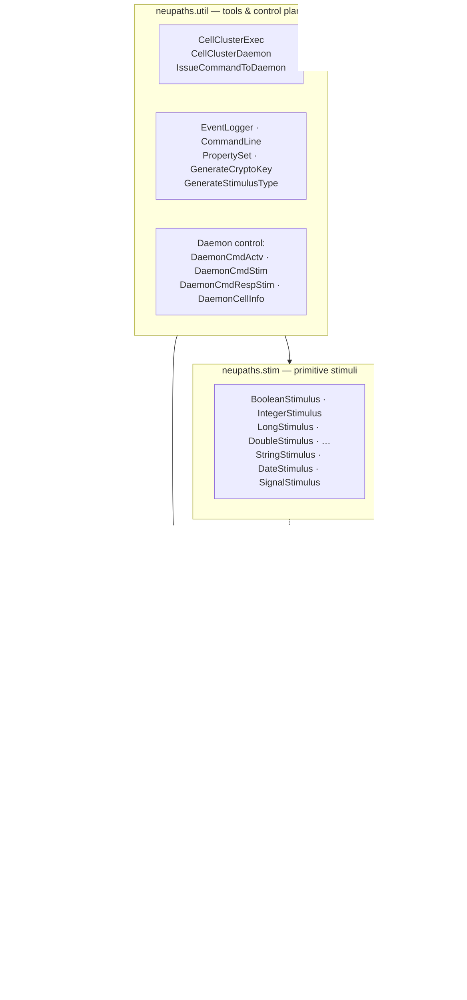
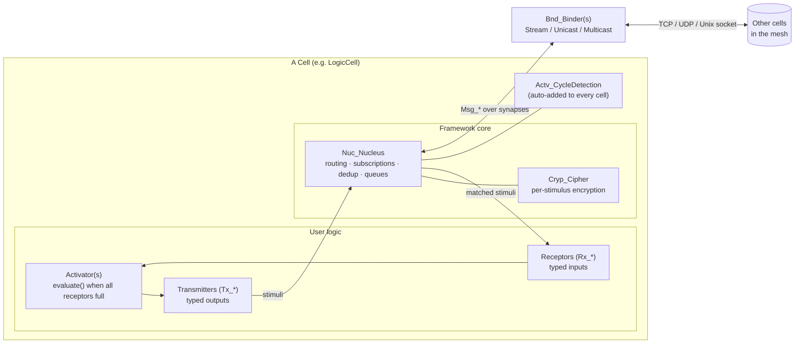
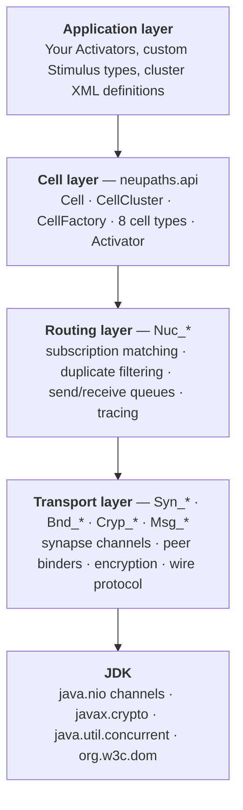
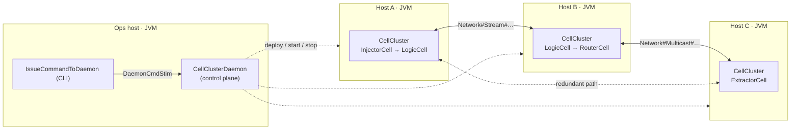

# 1 · Architecture Overview

## 1.1 Design principles

NeuPaths is shaped by four architectural commitments, each visible directly in the code:

1. **No broker, no center.** There is no server, queue, or coordinator class. Every cell
   carries its own routing engine (`Nuc_Nucleus`) and talks *peer-to-peer* to other cells
   over synapses. Resilience is a property of the mesh shape, not of a component.
2. **Dataflow execution.** An `Activator` runs only when **all** of its receptors hold a
   stimulus. Timing and priority are dictated entirely by data arrival. Cells sleep on OS
   wait-queues between stimuli (semaphore-blocked threads) — no polling.
3. **Location transparency.** A cell neither knows nor cares whether a peer is in the same
   JVM or across a data center. The `Syn_*` transport abstraction hides TCP / UDP /
   multicast / Unix-socket differences behind one synapse name string.
4. **Pure Java SE, self-contained.** No native code, no third-party dependencies — only the
   JDK (NIO channels, `javax.crypto`, `org.w3c.dom`). It deploys as a single JAR.

## 1.2 Package diagram

`neupaths.api` is the core and is self-contained. `neupaths.stim` supplies ready-made
`Stimulus` subclasses for Java primitives. `neupaths.util` sits on top, providing the
command-line entry points and a **daemon control plane** for deploying and operating
clusters of cells.

## 1.3 Component diagram — the anatomy of one cell

Every cell has the same internal shape regardless of its type. The user supplies
**Activators**; the framework supplies the **Nucleus** and its transport.

- **Receptors** pull stimuli that satisfy a subscription; the **Activator** fires when all
  receptors are full; **Transmitters** emit results back into the Nucleus.
- The **Nucleus** owns one or more **Binders** (`Bnd_*`), one per synapse, which speak the
  `Msg_*` wire protocol over the actual transport. Each stimulus can be encrypted per-hop
  by a **Cipher** (`Cryp_*`).
- A **cycle-detection activator** is transparently added to every cell to keep stimuli from
  looping forever through redundant paths.

## 1.4 Layering

Each layer depends only on the one below it. Application code touches only the Cell layer
(and writes `Activator`/`Stimulus` subclasses); everything under the Nucleus is internal.

## 1.5 Deployment view

A NeuPaths system is a set of JVM processes, each hosting one `CellCluster`, wired into a
mesh by synapses. There is no central node — any process can host any cells.

- **Synapse names** are strings such as `Network#Stream#Listener#@#30001` that fully
  describe scope, transport type, role, domain and options (see
  [§3.2](03-subsystems.md#32-transport-subsystem-syn_-and-bnd_)).
- **Redundant paths** (the dotted link) are safe because each Nucleus filters duplicate
  stimuli — the same signal arriving by two routes is delivered once.
- The **daemon** (`CellClusterDaemon`) is an *optional* operational convenience, not a
  broker: it deploys and controls clusters but no application traffic flows through it.

## 1.6 Cross-cutting concerns

| Concern | Where it lives | Notes |
|---------|----------------|-------|
| **Concurrency** | `Cell` inner threads (`StartupThread`, `PulseThread`, `ActivatorThread`), `Nuc_Nucleus` threads (`ReceiveThread`, `TransmitThread`, `StimuliHistoryThread`, `SubscriptionTraceThread`) | One activator thread per activator; blocking on `Semaphore`s; state guarded by `ReentrantLock`, `SafeBoolean`, `SafeLong`, `SynchronizedValue`. |
| **Security** | `Cryp_*` | Per-stimulus symmetric encryption (AES-CBC or Blowfish) into `SealedObject`; cipher chosen by the first byte of the crypto key. |
| **Resilience** | mesh shape + `Nuc_Nucleus` duplicate filtering + `Actv_CycleDetection` | No single point of failure; duplicates filtered by a time-windowed stimulus-history journal. |
| **Observability** | `EventType`/`EventStimulus`, `Cell` logging toggles, `EventLogger`, stimulus tracing (`Stim_Trace`) | 15 event levels (RUNTIME, TRACE, DEBUG, INFORMATION, WARNING, ERROR, AUDIT1–9). |
| **Configuration** | `Cfg_*` (XML/DOM) + `PropertySet` | Clusters and cells are declared in XML and instantiated reflectively by `CellFactory`. |
| **Flow control** | `LoadControllerCell` + `LoadBalancedCell` + `Actv_LoadBalance*` | A controller hands work signals to a pool of interchangeable worker cells. |
| **Transactions** | `Stim_CreateTransaction` / `Stim_TerminateTransaction`, `Rx_Transaction` | Correlate a set of stimuli through a multi-step computation via a `transactionID`. |

Continue to the [Domain Model class diagrams →](02-domain-model.md)
