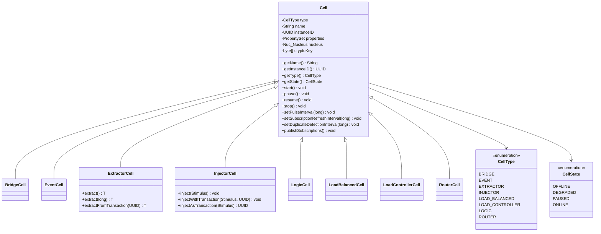
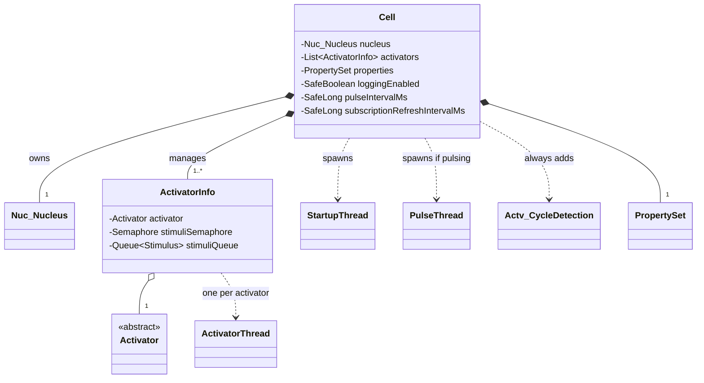
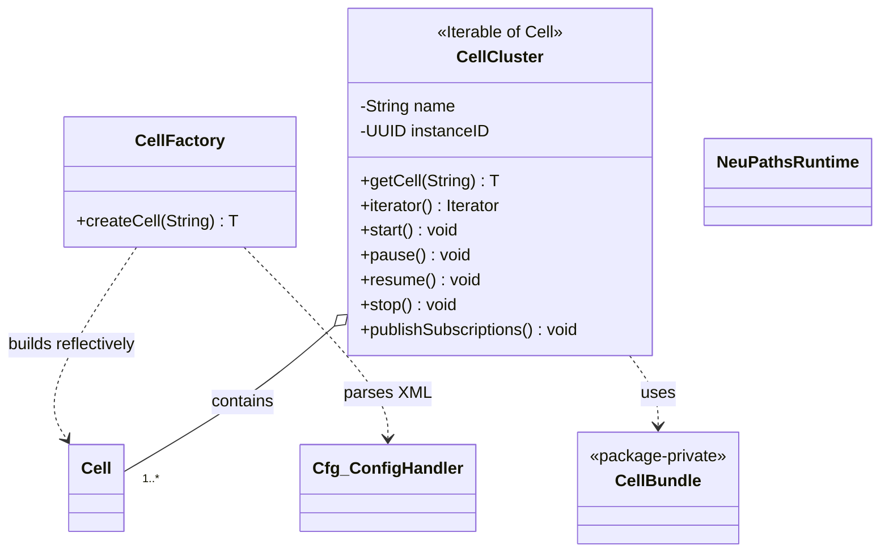
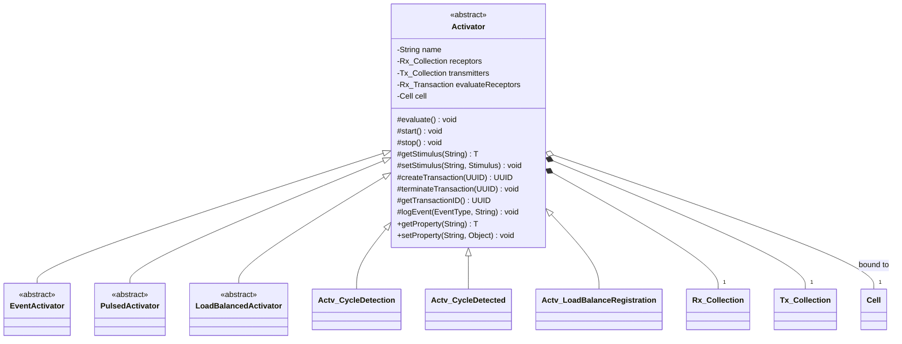
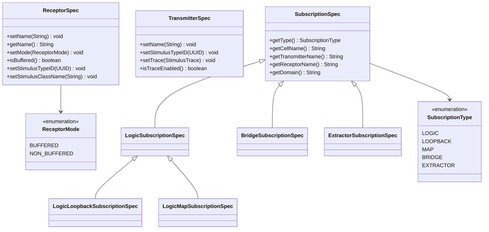
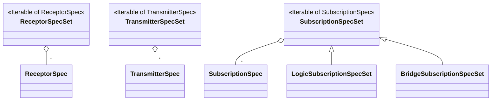
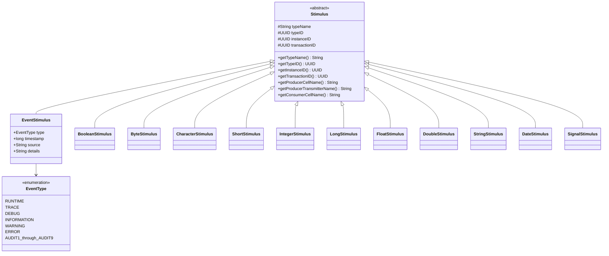

# 2 · Domain Model — Core Class Diagrams

This document models the **public API** — the types application developers work with
directly. Internal subsystems (nucleus, transport, config) are covered in
[§3](03-subsystems.md).

## 2.1 The cell type hierarchy

All eight primitive cell types extend the base `Cell`. A cell is created from an XML
definition via `CellFactory`; related cells are grouped and operated as a `CellCluster`.

### Role of each cell type

| Cell type | Uses activators? | Uses subscriptions? | Purpose |
|-----------|:---:|:---:|---------|
| `LogicCell` | ✅ | ✅ (Logic) | The workhorse — runs your `Activator`s to process and produce stimuli. |
| `InjectorCell` | — | — (has a transmitter) | Bridge from ordinary code *into* the mesh: `inject(stimulus)`. |
| `ExtractorCell` | — | ✅ (Extractor) | Bridge from the mesh *out to* ordinary code: `extract()`. |
| `RouterCell` | — | — | Forwards stimuli across synapses; extends reach without processing. |
| `BridgeCell` | — | ✅ (Bridge) | Moves stimuli **between domains** by maintaining presence in several. |
| `EventCell` | — | — | Collects `EventStimulus` log events for a domain (used by `EventLogger`). |
| `LoadBalancedCell` | ✅ (`LoadBalancedActivator`) | ✅ (Logic) | A worker that shares load with peers running the same activator. |
| `LoadControllerCell` | ✅ | ✅ (Logic) | Coordinator that decides which worker handles the next stimuli set. |

## 2.2 Cell composition & lifecycle machinery

The base `Cell` composes a **Nucleus** (its routing engine) and a list of **Activators**,
and manages worker threads. A cycle-detection activator is added to *every* cell.

- Each activator gets its **own thread** (`ActivatorThread`) and a semaphore-guarded
  stimulus queue — this is what makes cells parallel by nature.
- `PulseThread` exists only when `setPulseInterval()` enabled a periodic signal; act on
  pulses by including a `PulsedActivator` (see §2.4).
- `Actv_CycleDetection` is added transparently so stimuli cannot loop forever through
  redundant paths.

## 2.3 Cluster creation & runtime

- `CellFactory.createCell(defFile)` reads a cluster/cell **XML definition**, parses it with
  the `Cfg_*` DOM handlers (see [§3.5](03-subsystems.md#35-configuration-subsystem-cfg_)),
  and reflectively instantiates cells, activators, receptors and transmitters.
- `CellCluster` is an `Iterable<Cell>` that applies lifecycle and tuning operations across
  all its member cells at once. `CellBundle` (package-private) groups the cells produced
  from a single definition file.

## 2.4 The Activator model (dataflow logic)

`Activator` is the abstract base of all user logic. It declares typed **receptors** and
**transmitters** and a set of **logic subscriptions** that wire it to producers. The single
abstract method `evaluate()` runs when every receptor holds a stimulus.

The three public abstract subclasses are the extension points: `EventActivator` consumes
`EventStimulus`, `PulsedActivator` acts on periodic pulses, and `LoadBalancedActivator`
participates in a worker pool. The `Actv_*` subclasses are internal control-plane logic.

> **Dataflow contract.** `evaluate()` is called by the cell's activator thread only once
> **all** receptors are non-empty. The activator reads inputs with `getStimulus(receptor)`,
> computes, and emits with `setStimulus(transmitter, stimulus)`. Between firings the thread
> sleeps on a semaphore. See the activity diagram in [§4.3](04-behavior.md#43-dataflow-evaluation-activity).

Constructor (package-private, invoked by subclasses):
`Activator(String name, ReceptorSpec[] receptors, TransmitterSpec[] transmitters, LogicSubscriptionSpec[] subscriptions)`.

## 2.5 Receptors, transmitters & the subscription model

Activators are wired to each other by **subscriptions**. A subscription is the contract
`(producing cell C, transmitter T) ⇒ receptor R`, tagged with a **domain**. `C` and `T`
may be regular expressions, so one receptor can aggregate stimuli from many producers.

### Spec collections (the sets held by activators/cells)

| Subscription kind | Used by | Meaning |
|-------------------|---------|---------|
| `LogicSubscriptionSpec` | LogicCell, LoadBalanced/Controller | Pull stimuli to an activator's receptor for evaluation. |
| `LogicLoopbackSubscriptionSpec` | LogicCell | Feed one of the cell's own transmitters back into a receptor. |
| `LogicMapSubscriptionSpec` | LogicCell | Map/route variant of a logic subscription. |
| `BridgeSubscriptionSpec` | BridgeCell | Pull stimuli into a bridge to relay across domains (no receptor). |
| `ExtractorSubscriptionSpec` | ExtractorCell | Pull stimuli out to client code (the cell *is* the receptor). |

- **Receptor mode** `BUFFERED` queues arriving stimuli; `NON_BUFFERED` keeps only the
  latest — the choice governs back-pressure vs. freshness at each input.

## 2.6 The Stimulus model

`Stimulus` is the atomic, serializable unit of data. Each instance carries type identity,
a unique instance id, an optional transaction id, and producer/consumer metadata that the
framework fills in as the stimulus travels.

**The `neupaths.stim` pattern.** Every primitive stimulus follows the same shape: a wrapped
value, `get()`/`set()` accessors, `equals`/`hashCode`/`toString`, and two static constants —
`TYPE_NAME` (String) and `TYPE_ID` (a fixed `UUID`). The `TYPE_ID` is how the framework and
subscriptions identify stimulus types across the wire without relying on class names. New
custom stimulus types are generated with `GenerateStimulusType`, which stamps a fresh
`TYPE_ID` (see [§3.6](03-subsystems.md#36-utilities--the-daemon-control-plane)).

> `EventType` has 15 values: `RUNTIME`, `TRACE`, `DEBUG`, `INFORMATION`, `WARNING`,
> `ERROR`, and `AUDIT1` … `AUDIT9`.

Continue to the [Subsystem class diagrams →](03-subsystems.md)
