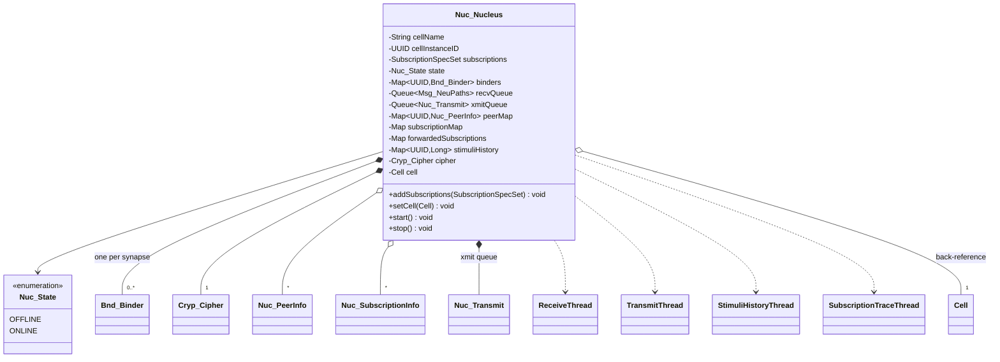
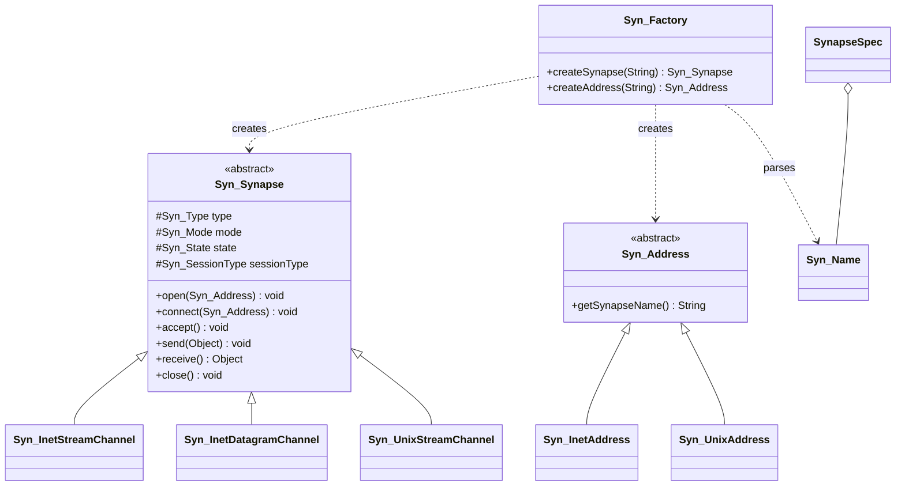
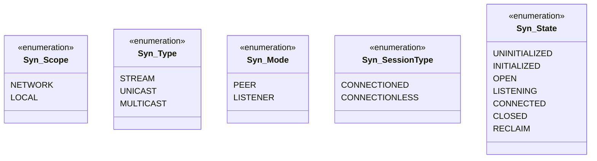
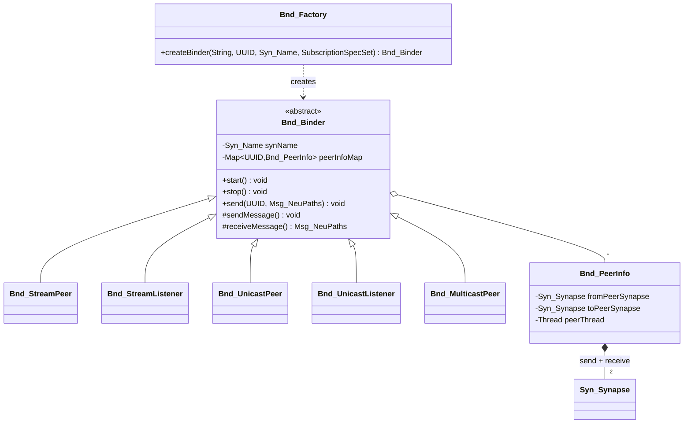
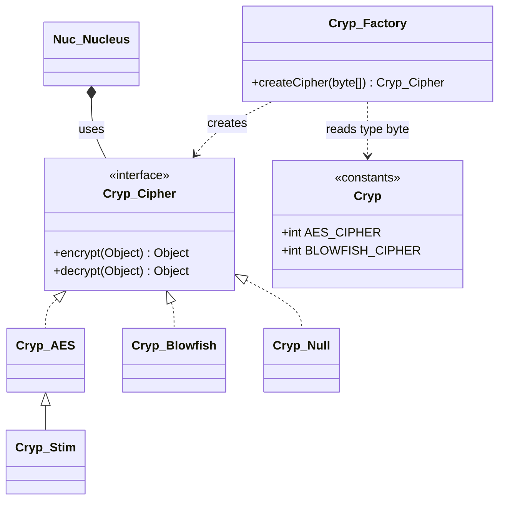
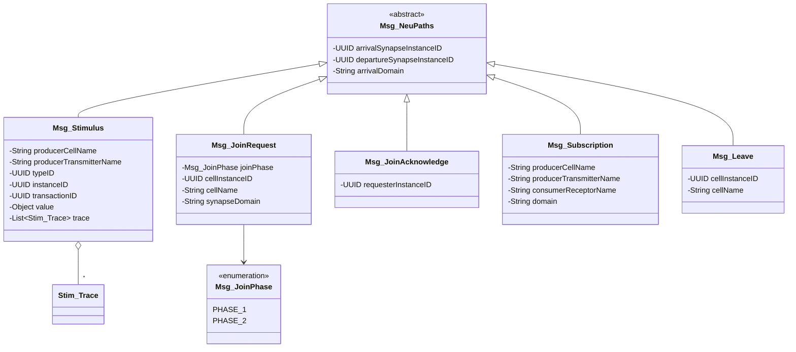
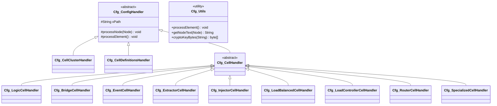
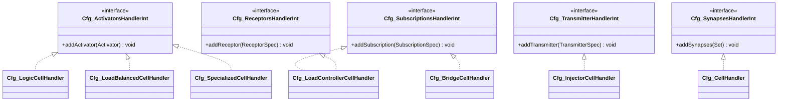
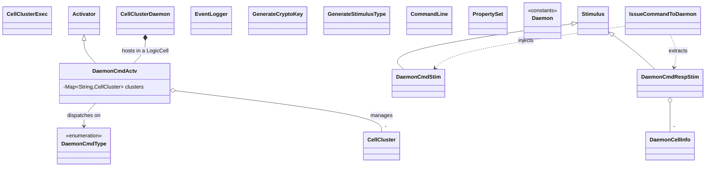
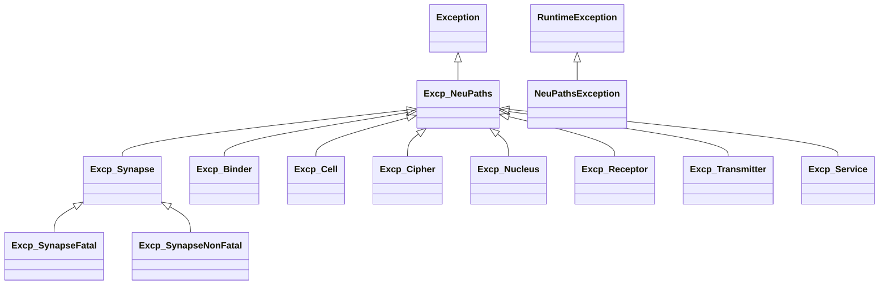

# 3 · Subsystem Class Diagrams

These are the internal (mostly package-private) subsystems beneath the public API. Class
prefixes name the subsystem: `Nuc_` nucleus, `Syn_`/`Bnd_` transport, `Cryp_` crypto,
`Msg_` wire protocol, `Cfg_` configuration.

## 3.1 The Nucleus — per-cell routing engine (`Nuc_*`)

The `Nuc_Nucleus` is the heart of a cell. It owns the cell's binders, matches incoming
stimuli against subscriptions, filters duplicates, forwards subscriptions to peers, and
runs the send/receive worker threads. **This is what replaces the broker** — every cell
carries its own.



**Key responsibilities**

| Field / thread | Responsibility |
|----------------|----------------|
| `binders` | One `Bnd_Binder` per synapse; the actual network I/O endpoints. |
| `recvQueue` / `xmitQueue` + semaphores | Decouple network threads from routing; blocking queues so idle cells sleep. |
| `subscriptionMap` | Local subscriptions → which peer synapses satisfy them. |
| `forwardedSubscriptions` | Subscriptions learned from peers and re-advertised (how interest propagates across the mesh). |
| `stimuliHistory` + `StimuliHistoryThread` | Time-windowed journal of recently-seen stimulus ids → **duplicate filtering**; the window is `duplicateDetectionInterval`. |
| `SubscriptionTraceThread` | Periodically re-advertises subscriptions (`subscriptionRefreshInterval`) so the dynamic mesh stays wired. |
| `cipher` | Encrypts/decrypts each stimulus value on the wire. |

## 3.2 Transport subsystem (`Syn_*` and `Bnd_*`)

Two cooperating hierarchies: **synapses** are the raw channels (an abstraction over a JDK
NIO channel); **binders** manage the peer relationship and message framing over a synapse.

### Synapse channels & addresses



| Type | Transport |
|------|-----------|
| `Syn_InetStreamChannel` | TCP (`SocketChannel` / `ServerSocketChannel`) |
| `Syn_InetDatagramChannel` | UDP unicast and multicast (`DatagramChannel`) |
| `Syn_UnixStreamChannel` | Unix-domain stream socket (`AF_UNIX`) |
| `Syn_InetAddress` | IP host + port |
| `Syn_UnixAddress` | filesystem socket path |

### Enumerations that make up a synapse name



**Synapse name grammar** (from `package-info`):

```
scope # type # mode # domain [ # opt1 [ # opt2 ... ] ]

  scope   = Network | Local
  type    = Stream (TCP) | Unicast (UDP) | Multicast (UDP)
  mode    = Listener | Peer
  domain  = case-sensitive name, or "@" for the global domain
  opts    = type-specific (e.g. port, host/IP, multicast group, socket path)

Examples:
  Network#Stream#Listener#@#30001
  Network#Unicast#Peer#D1#30001#192.168.1.10
  Network#Multicast#Peer#@#30001#224.0.0.10
  Local#Stream#Listener#@#/tmp/neupaths.sock
```

### Binders — the peer relationship over a synapse



- **Listener vs Peer.** A `Listener` binder waits; when a `Peer` joins, the listener
  **spawns a new peer synapse** dedicated to that connection — the same "grow the mesh on
  contact" pattern for TCP, UDP-unicast and Unix streams.
- **Design patterns:** *Abstract Factory* (`Syn_Factory`, `Bnd_Factory`), *Strategy* (the
  synapse/binder subclasses per transport), *State* (`Syn_State` lifecycle), and the JDK
  *Cleaner* pattern for deterministic channel cleanup.

## 3.3 Cryptography subsystem (`Cryp_*`)

A pluggable cipher encrypts each stimulus value into a `javax.crypto.SealedObject` before
it crosses a synapse. The cipher is chosen by the **first byte of the crypto key**.



| Cipher | Algorithm |
|--------|-----------|
| `Cryp_AES` | `AES/CBC/PKCS5Padding`; first 16 key bytes are the IV. |
| `Cryp_Blowfish` | Blowfish. |
| `Cryp_Null` | Pass-through (no encryption). |
| `Cryp_Stim` | Default stimulus cipher — a fixed-key `Cryp_AES` used when no key is supplied. |

- The factory reads a type byte from the key: `Cryp.AES_CIPHER` (1) or
  `Cryp.BLOWFISH_CIPHER` (2). Supply a real key via `GenerateCryptoKey`.
- *Strategy + Factory* patterns; `Excp_Cipher` wraps all `javax.crypto` checked exceptions.

## 3.4 Wire protocol (`Msg_*`)

Everything crossing a synapse is a `Msg_NeuPaths`. One message type carries application
data (`Msg_Stimulus`); the rest form the **control plane** for the broker-less mesh:
peer join, subscription advertisement, and departure.



| Message | Plane | Role |
|---------|-------|------|
| `Msg_Stimulus` | data | Carries a user stimulus (value + trace) across a synapse. |
| `Msg_JoinRequest` | control | A peer advertises join intent and its send/receive synapse endpoints. |
| `Msg_JoinAcknowledge` | control | The listener reciprocates its endpoints. |
| `Msg_Subscription` | control | Declares interest in a producer's transmitter for a receptor. |
| `Msg_Leave` | control | Notifies the mesh of a departing cell so peers clean up. |

The join handshake sequence is drawn in [§4.4](04-behavior.md#44-peer-join-handshake-sequence).

## 3.5 Configuration subsystem (`Cfg_*`)

Clusters and cells are declared in **XML** and parsed with a **DOM**, recursive-descent set
of handlers. `CellFactory` drives it. Handler *interfaces* (`*HandlerInt`) are callback
contracts by which a child handler pushes its parsed result up to its parent — a
Chain-of-Responsibility / Composite arrangement mirroring the XML nesting.



`Cfg_CellClusterHandler` parses the `<Cell_Cluster>` root and delegates to
`Cfg_CellDefinitionsHandler` for the list of cell-definition files. Each `Cfg_CellHandler`
subclass parses one cell type, capturing its name, properties, synapses and logging config.

**Handler callback interfaces** (child ⇒ parent aggregation):



The nested element handlers (`Cfg_CellPropertiesHandler` → `Cfg_CellPropertyHandler`,
`Cfg_CellSubscriptionsHandler` → `Cfg_CellSubscriptionHandler`,
`Cfg_CellActivatorsHandler` → `Cfg_CellActivatorHandler`,
`Cfg_CellReceptorsHandler` → `Cfg_CellReceptorHandler`,
`Cfg_CellTransmitterHandler`) follow the same container→item pattern and use **reflection**
(`Class.forName`) to instantiate `Activator`s and to read each stimulus type's `TYPE_ID`.

## 3.6 Utilities & the daemon control plane (`neupaths.util`)

Command-line tools and a background **daemon** for operating clusters. The daemon itself is
built *from NeuPaths cells* — the control plane eats its own dog food.



The six CLI entry points (each has a `main()`): `CellClusterExec`, `CellClusterDaemon`,
`IssueCommandToDaemon`, `EventLogger`, `GenerateCryptoKey`, `GenerateStimulusType`.
`DaemonCmdStim`/`DaemonCmdRespStim` are `Stimulus` subclasses; `DaemonCmdActv` is an
`Activator`; `PropertySet` is a thread-safe, serializable, iterable name/value map used for
arguments and cell properties throughout.

**Control-plane flow.** `CellClusterDaemon` hosts a `LogicCell` whose `DaemonCmdActv`
listens for `DaemonCmdStim` commands (discover / deploy / start / pause / stop / logging —
33 in `DaemonCmdType`). `IssueCommandToDaemon` uses an `InjectorCell` to send a command and
an `ExtractorCell` to receive the `DaemonCmdRespStim` — i.e. the operator tooling is itself
an ordinary NeuPaths client talking over synapses, with no privileged backchannel.

## 3.7 Exception hierarchy

Two roots: a checked `Excp_NeuPaths` family used internally by subsystems, and a single
unchecked `NeuPathsException` surfaced to API callers.



- Internal subsystems throw specific checked `Excp_*` types; boundaries (e.g. `Cell`,
  `Activator`) translate failures into the unchecked `NeuPathsException` for callers.
- `Excp_SynapseFatal` vs `Excp_SynapseNonFatal` lets the transport distinguish a dead
  connection (tear down) from a recoverable hiccup (retry) — key to mesh resilience.

Continue to the [Behavioral diagrams →](04-behavior.md)
