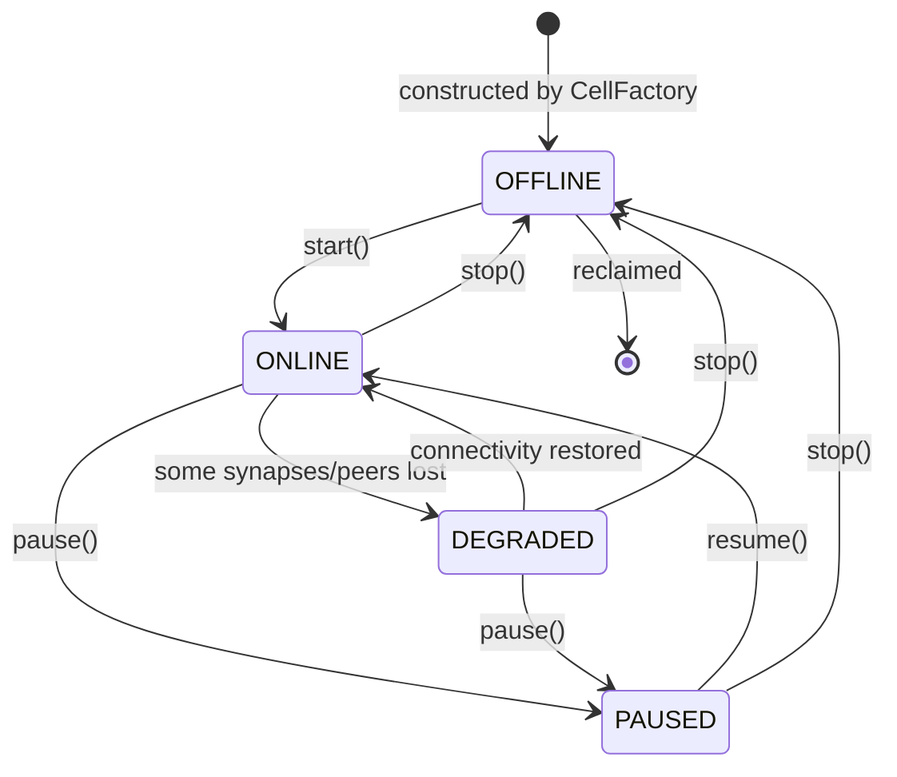
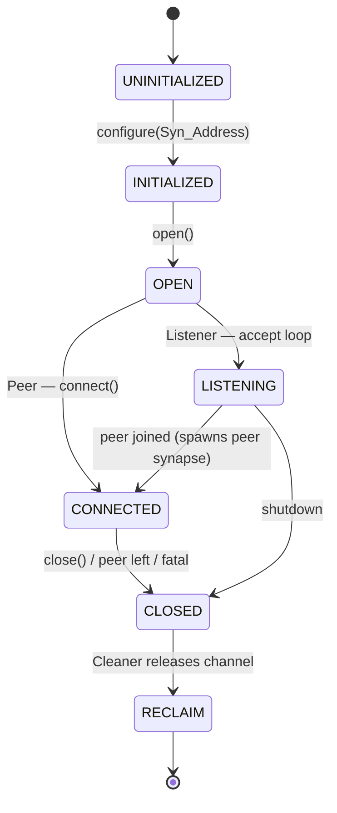
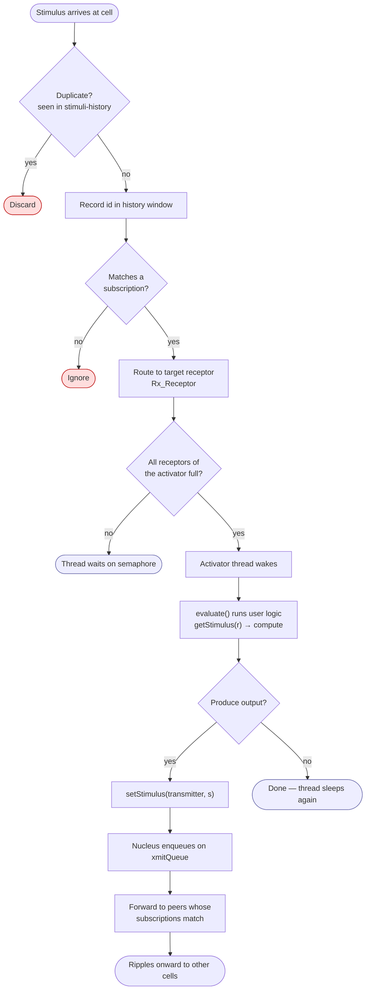
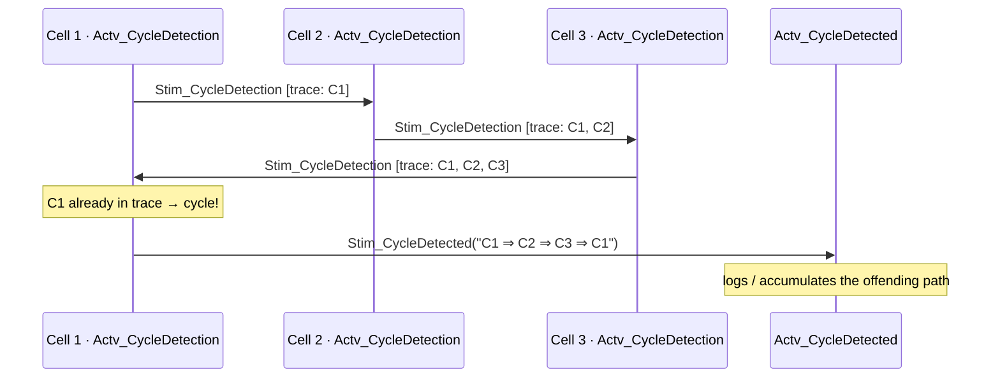

# 4 · Behavioral Diagrams

How the design *behaves* at runtime: lifecycles (state machines), the dataflow firing rule
(activity), and the peer/stimulus protocols (sequence).

## 4.1 Cell lifecycle (state machine)

`Cell.getState()` returns a `CellState`. A cell is built offline, brought online by
`start()`, and can be paused/resumed or stopped. `DEGRADED` reflects partial loss of
synapse connectivity — the mesh keeps a cell working even when some paths are down.



Underneath, each cell's `Nuc_Nucleus` tracks a simpler `Nuc_State` of `OFFLINE`/`ONLINE`,
and each synapse runs the richer `Syn_State` machine below.

## 4.2 Synapse lifecycle (state machine)

`Syn_Synapse` transitions through `Syn_State` as a connection is opened, established and
eventually reclaimed. Listener and Peer synapses diverge at the `OPEN` step.



## 4.3 Dataflow evaluation (activity)

The defining behavior of NeuPaths: an activator fires **only when every receptor holds a
stimulus**. This is what makes the system event-driven and lets idle cells sleep.



Because receptors gate evaluation, a "neuron" that needs three signals waits quietly until
all three arrive, then fires once — possibly emitting new stimuli that propagate across the
mesh. Independent cells run this loop concurrently without coordinating.

## 4.4 Peer join handshake (sequence)

When a `Peer` binder contacts a `Listener`, they perform a **two-phase join**
(`Msg_JoinPhase.PHASE_1` / `PHASE_2`) that establishes a bidirectional link, then exchange
`Msg_Subscription` so stimuli can start flowing. This is the decentralized replacement for
"register with the broker."

```mermaid
sequenceDiagram
    participant PA as Cell A · Bnd_StreamPeer
    participant LB as Cell B · Bnd_StreamListener
    participant PB as Cell B · spawned peer synapse

    PA->>LB: Msg_JoinRequest(PHASE_1)<br/>cellName, send/receive synapse ids
    Note over LB: accept() spawns a dedicated<br/>peer synapse for A
    LB->>PB: create Bnd_PeerInfo
    LB-->>PA: Msg_JoinAcknowledge(PHASE_1)<br/>B's reciprocal synapse ids
    PA->>PB: Msg_JoinRequest(PHASE_2) — confirm link
    PB-->>PA: Msg_JoinAcknowledge(PHASE_2) — ready

    Note over PA,PB: bidirectional synapse established

    PA->>PB: Msg_Subscription (A's interests)
    PB->>PA: Msg_Subscription (B's interests)
    Note over PA,PB: each Nucleus records peer↔subscription mapping;<br/>refreshed periodically by SubscriptionTraceThread

    loop while both online
        PA-->>PB: Msg_Stimulus (matched data)
        PB-->>PA: Msg_Stimulus (matched data)
    end

    PA->>PB: Msg_Leave (on shutdown)
    Note over PB: cleanup peer info, close synapse
```

Subscriptions are **re-advertised on a timer**, so a peer that joins later, or a link that
recovers, becomes wired automatically — the mesh is self-healing rather than statically
configured.

## 4.5 End-to-end stimulus flow: Injector → Logic → Extractor (sequence)

The canonical way ordinary code interacts with a cellular system: an `InjectorCell` pushes
data in, one or more `LogicCell`s transform it, and an `ExtractorCell` pulls the result out
— across process/host boundaries, with duplicate filtering along the way.

```mermaid
sequenceDiagram
    actor App as Client code
    participant Inj as InjectorCell
    participant NI as Nucleus (Inj)
    participant NL as LogicCell.Nucleus
    participant ACT as Activator.evaluate()
    participant NE as ExtractorCell.Nucleus
    participant Ext as ExtractorCell

    App->>Inj: inject(stimulus)
    Inj->>NI: enqueue on xmitQueue
    NI->>NL: Msg_Stimulus over synapse<br/>(encrypted via Cryp_Cipher)
    NL->>NL: dedup check + subscription match
    NL->>ACT: fill receptor; all full → wake thread
    ACT->>ACT: compute result
    ACT->>NL: setStimulus(transmitter, result)
    NL->>NE: Msg_Stimulus over synapse
    NE->>Ext: deliver to extractor receptor
    App->>Ext: extract()  (blocks until available)
    Ext-->>App: result stimulus
```

With **transactions**, `injectAsTransaction()` returns a `transactionID`, and
`extractFromTransaction(id)` retrieves the specific correlated result — letting a request
and its response be matched even when many flow concurrently.

## 4.6 Built-in cycle detection (sequence)

Because redundant paths are encouraged, stimuli could loop forever. Every cell silently
carries an `Actv_CycleDetection`; a probe stimulus accumulates a trace of visited cells, and
when a cell sees itself already in the trace it raises `Stim_CycleDetected`.



## 4.7 Load balancing (sequence)

A `LoadControllerCell` coordinates a pool of interchangeable `LoadBalancedCell` workers.
Workers **register** and then **poll for a work signal**; the controller hands the next
stimulus set to exactly one worker — spreading load without a central queue.

```mermaid
sequenceDiagram
    participant W1 as LoadBalancedCell #1
    participant W2 as LoadBalancedCell #2
    participant Ctl as LoadControllerCell

    W1->>Ctl: Stim_LoadBalanceRegistration(id1)
    W2->>Ctl: Stim_LoadBalanceRegistration(id2)
    loop periodic (Actv_LoadBalanceRegistration)
        W1->>Ctl: Stim_LoadBalanceRequest(id1)
        W2->>Ctl: Stim_LoadBalanceRequest(id2)
    end
    Note over Ctl: work arrives; pick next available worker
    Ctl-->>W1: Stim_LoadBalanceSignal(id1) + Stim_LoadBalanceTransaction(txn)
    Note over W1: this worker processes the stimuli set
    W1->>W1: LoadBalancedActivator.evaluate()
```

## 4.8 Cluster startup (sequence)

```mermaid
sequenceDiagram
    actor Op as Operator / CellClusterExec
    participant CF as CellFactory
    participant Cfg as Cfg_* DOM handlers
    participant CC as CellCluster
    participant Cell as each Cell
    participant Nuc as each Nucleus

    Op->>CF: createCell(clusterDef.xml)
    CF->>Cfg: parse XML (recursive handlers)
    Cfg-->>CF: cell/activator/receptor/transmitter specs
    CF->>Cell: construct (reflective) + attach Activators
    Cell->>Nuc: new Nuc_Nucleus(synapses, cryptoKey)
    CF-->>Op: CellCluster
    Op->>CC: start()
    loop for each Cell
        CC->>Cell: start()
        Cell->>Nuc: bring binders ONLINE, spawn threads
        Nuc->>Nuc: open synapses → join peers (§4.4)
    end
    Note over CC: mesh is live; stimuli now flow on data arrival
```

---

### Traceability summary

| Behavior | Primary types | Diagram |
|----------|---------------|---------|
| Cell lifecycle | `Cell`, `CellState`, `Nuc_State` | §4.1 |
| Synapse lifecycle | `Syn_Synapse`, `Syn_State` | §4.2 |
| Dataflow firing rule | `Activator`, `Rx_Receptor`, `Nuc_Nucleus` | §4.3 |
| Peer join / mesh formation | `Bnd_*`, `Msg_Join*`, `Msg_Subscription` | §4.4 |
| App ↔ mesh round-trip | `InjectorCell`, `ExtractorCell`, transactions | §4.5 |
| Cycle detection | `Actv_CycleDetection`, `Stim_CycleDetect*` | §4.6 |
| Load balancing | `LoadControllerCell`, `LoadBalancedCell`, `Stim_LoadBalance*` | §4.7 |
| Cluster startup | `CellFactory`, `Cfg_*`, `CellCluster` | §4.8 |

Continue to the [Execution Model →](05-execution-model.md)
