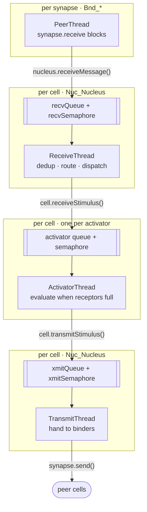
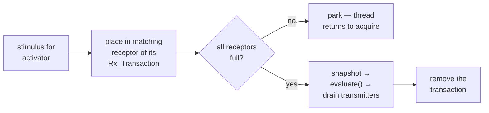

# 5 · Execution Model — Threads & Dataflow

NeuPaths is **thread-per-role**, not thread-per-request. A stimulus is handed across a series
of in-memory queues, and a dedicated thread owns each stage. This is what makes the framework
*parallel by nature* (independent stages and independent cells run at once) yet *asleep when
idle* (every consumer blocks on a semaphore until work arrives — no polling, no spinning).

## 5.1 The handoff idiom

Every stage boundary uses the same construct: a `LinkedList` guarded by a **fair**
`ReentrantLock(true)`, paired with a counting **`Semaphore(0, true)`** that signals "data
available." A producer enqueues under the lock and calls `release()`; a consumer calls
`acquire()` (blocking when the queue is empty), then dequeues under the lock.

```java
// producer                              // consumer
mutex.lock();                            semaphore.acquire();   // sleeps here when idle
try   { queue.addLast(item); }           mutex.lock();
finally { mutex.unlock(); }              try   { item = queue.pollFirst(); }
semaphore.release();                     finally { mutex.unlock(); }
```

Because the consumer parks inside `acquire()`, an idle cell consumes no CPU. Fairness on both
the lock and the semaphore preserves **FIFO order within a single queue**.

## 5.2 The pipeline



Walking the path:

1. A binder **`PeerThread`** blocks on `synapse.receive()`; on a message it calls
   `nucleus.receiveMessage(msg)`, which enqueues to `recvQueue` and releases `recvSemaphore`.
2. The single **`ReceiveThread`** drains `recvQueue`, runs duplicate detection against the
   `stimuliHistory` journal, routes/forwards, and for a matched `Msg_Stimulus` calls
   `cell.receiveStimulus()`.
3. `receiveStimulus()` **fans out**: for every activator whose `isInterested()` returns true,
   it calls `activatorThread.announceStimulus()`, enqueuing to *that activator's private queue*.
4. Each **`ActivatorThread`** drains its own queue and calls `evaluateStimulus()`.
5. When the activator's inputs are complete (§5.4) your `evaluate()` runs; outputs are drained
   from the transmitters via `cell.transmitStimulus()`, which enqueues to `xmitQueue`.
6. The single **`TransmitThread`** drains `xmitQueue` and hands each message to the binders,
   which `synapse.send()` to peers.

The single `ReceiveThread` (inbound) and single `TransmitThread` (outbound) act as
**serialization points** per cell — duplicate detection and routing need no hot-path locking
beyond the history mutex, and outbound ordering is well-defined.

## 5.3 Thread inventory

Threads present in one running cell:

| Thread | Scope | Count | Lifetime | Responsibility |
|--------|-------|:-----:|----------|----------------|
| `ActivatorThread` | Cell | **1 per activator** | long-lived | Drains the activator's queue and runs `evaluateStimulus()` → `evaluate()`. Priority `NORM_PRIORITY + 2`. |
| `StartupThread` | Cell | 1 per activator | transient | Sleeps `1.1 × subscriptionRefreshInterval` (or `1000 ms` when refresh is disabled), then starts the activator + its `ActivatorThread`, posts initial stimuli, and exits. Staggers startup so subscriptions propagate first. |
| `PulseThread` | Cell | 0 or 1 | long-lived | Emits a periodic `DateStimulus`; exists only when `setPulseInterval(> 0)`. |
| `ReceiveThread` | Nucleus | 1 | long-lived | Inbound serializer: dedup, route/forward, dispatch to activators. |
| `TransmitThread` | Nucleus | 1 | long-lived | Outbound serializer: drain `xmitQueue`, hand to binders. |
| `StimuliHistoryThread` | Nucleus | 1 | long-lived | Evicts expired ids from the duplicate-detection journal (the `duplicateDetectionInterval` window). |
| `SubscriptionTraceThread` | Nucleus | 0 or 1 | long-lived | Periodic subscription tracing (only if that interval is set). |
| `ListenThread` | Binder | 1 per listener synapse | long-lived | Accepts joins; spawns a `PeerThread` per connection. |
| `PeerThread` | Binder | 1 per connected peer | long-lived | Blocks on `synapse.receive()`; calls `nucleus.receiveMessage()`. |
| `SubscriptionRefreshThread` | Binder | 1 per binder | long-lived | Periodically re-advertises this cell's subscriptions to peers — keeps the dynamic mesh wired and self-healing. |

> **Rough count.** A cell with **A** activators and **P** live peer connections runs about
> **A** activator threads + **4** nucleus threads + per-binder threads (`listener + P peers +
> refresh`). Every cell auto-adds an `Actv_CycleDetection`, so `A ≥ 1` always. Independent
> cells share no state and run fully concurrently.

## 5.4 The dataflow gate

The firing rule lives in `Activator.evaluateStimulus()`. Incoming stimuli are placed into an
**`Rx_Transaction`** — a bundle of receptors keyed by `transactionID`. Each stimulus fills its
matching receptor; `evaluate()` runs **only** when `transaction.isComplete()`, i.e. *every*
receptor holds a stimulus.



Keying by `transactionID` means **several half-complete input sets can be assembled
concurrently** — a neuron waiting on three signals can hold multiple partial bundles in flight,
each completing independently. A `MAP` subscription keys the receptor slot by producing
transmitter name instead of receptor name, letting one receptor gather many producers.

## 5.5 Properties & guarantees

| Property | Behavior |
|----------|----------|
| **Ordering** | FIFO *within* a single activator's queue (fair lock + fair semaphore). **No** global ordering across activators, and **no** cross-cell ordering. |
| **Parallelism** | Activators within a cell run concurrently (one thread each); independent cells are fully independent. |
| **Duplicate safety** | The single `ReceiveThread` checks a time-windowed `stimuliHistory` map before routing, so the same stimulus arriving by two mesh paths is delivered once. |
| **Synchronization** | Fine-grained fair locks — separate mutexes for `recvQueue`, `xmitQueue`, `peerMap`, `subscriptionMap`, `forwardedSubscriptions`, `stimuliHistory`. Flags/tunables use `SynchronizedValue<T>` (`SafeBoolean`, `SafeLong`) with `synchronized` accessors. |
| **Priority** | `ActivatorThread` runs at `NORM_PRIORITY + 2` so evaluation keeps pace with I/O threads. |

## 5.6 Sharp edges

- **No backpressure.** All queues are unbounded `LinkedList`s. A slow activator grows its own
  queue without throttling upstream — watch this under sustained overload.
- **Pause accumulates.** `pause()` sets `activatorsPaused`; the `ActivatorThread` then loops on
  `Thread.sleep(500)` and stops consuming, but the Nucleus keeps receiving — so **stimuli pile
  up in queues while paused**.
- **Shutdown.** `stop()` sets `SafeBoolean` terminate flags and `interrupt()`s each thread to
  break it out of `acquire()`/`sleep()`, then drains permits and clears queues. Threads are
  **daemon by default** (the JVM can exit) unless the env var
  `NEUPATHS_FORCE_GRACEFUL_TERMINATION` is set, which makes them non-daemon for clean joins.

Back to the [documentation index](README.md).
