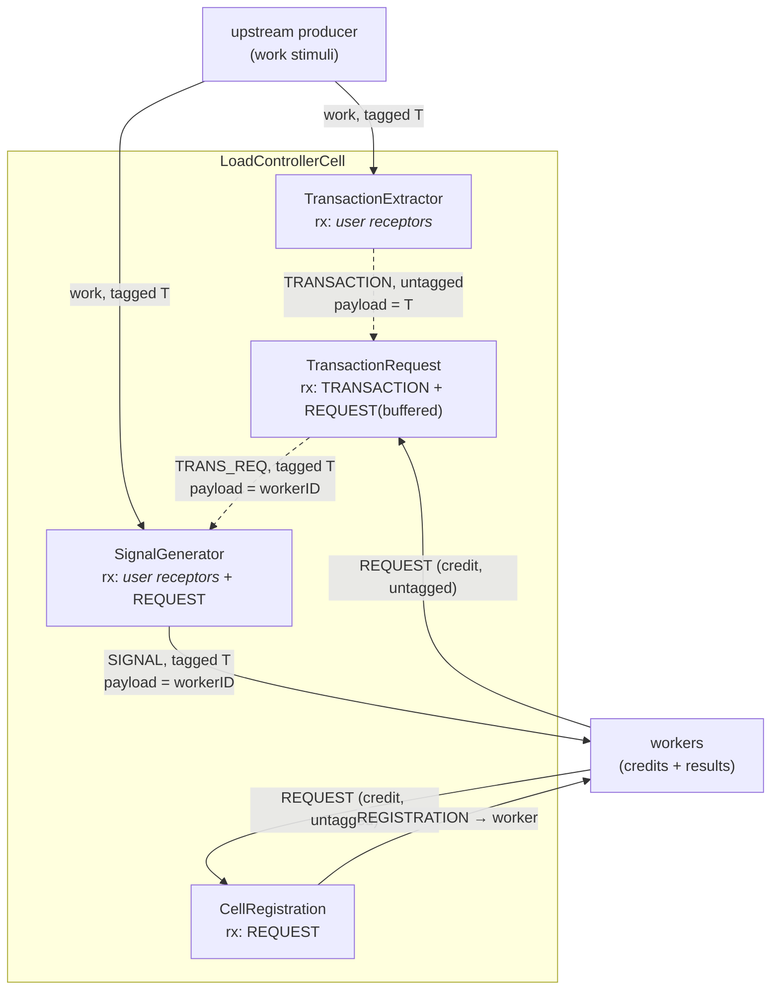
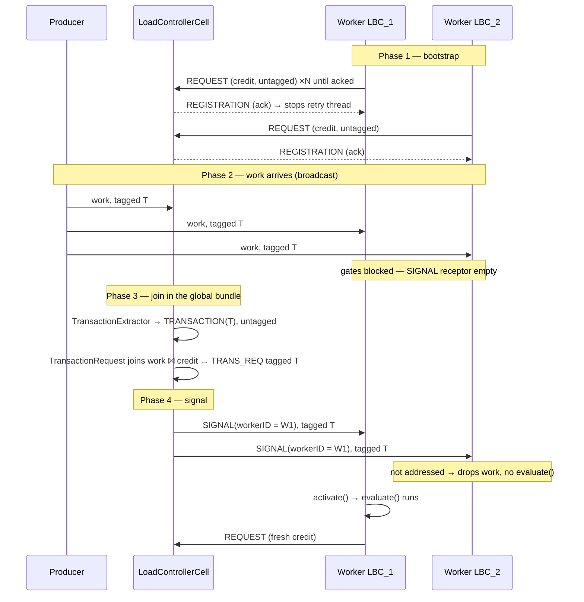
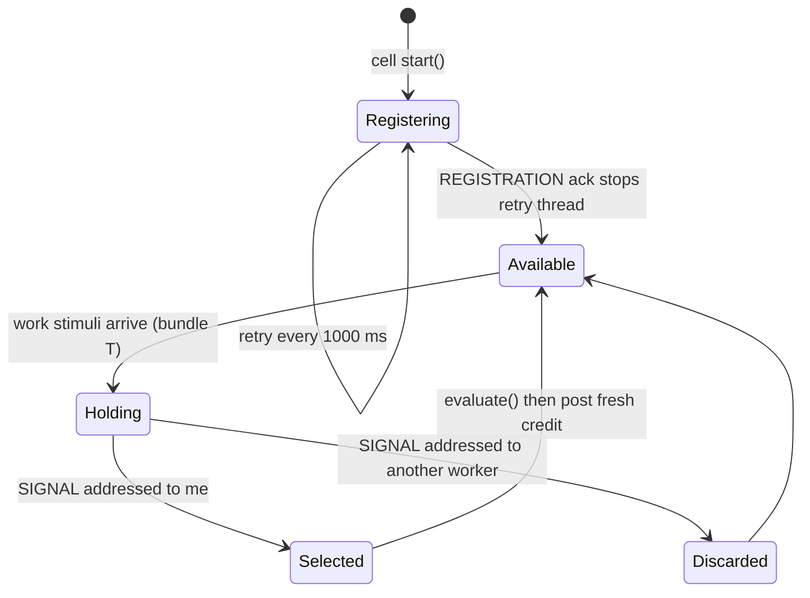

# 6 · Case Study — Load Balancing as a Distributed State Machine

Everything in the preceding documents is reference material. This one is a **case study**: a
close reading of the `LoadControllerCell` / `LoadBalancedCell` pair, which is the most
intricate piece of control logic in NeuPaths and the best worked example of what the
programming model can express.

It is worth studying because of the constraints it operates under. The framework has **no
broker, no shared queue, and no central scheduler**. A cell cannot call another cell. There is
no request/response primitive, no lock, no leader election. The only tools available are the
same ones an application developer has:

- activators with typed **receptors** and **transmitters**,
- **subscriptions** that wire producers to consumers,
- **loopback subscriptions** that wire an activator's output back into the same cell,
- and the **dataflow gate** — an activator fires only when *all* its receptors are full.

Out of exactly those pieces, the load-balancing subsystem builds a work distributor with
registration, matchmaking, targeted dispatch, and flow control. **Six activators across two
cell types**, wired so the emergent behavior is a distributed state machine. No component
holds the state machine; it exists in the flow of stimuli between them.

## 6.1 The cast

**Channel names** (`LB.java`) — five fixed UUIDs used as receptor/transmitter names:

| Constant | Carries | Role |
|----------|---------|------|
| `LB.REQUEST` | `Stim_LoadBalanceRequest` | A worker announcing "I am available." A **credit**. |
| `LB.REGISTRATION` | `Stim_LoadBalanceRegistration` | Controller's acknowledgement of a new worker. |
| `LB.TRANSACTION` | `Stim_LoadBalanceTransaction` | "A complete work item has arrived" (carries its id). |
| `LB.TRANS_REQ` | `Stim_LoadBalanceRequest` | Internal: a work item **matched to** a chosen worker. |
| `LB.SIGNAL` | `Stim_LoadBalanceSignal` | "Worker X: process this work item now." |

**The activators** — four inside the controller, two inside each worker:

| Activator | Lives in | Receptors | Emits |
|-----------|----------|-----------|-------|
| `CellRegistration` | Controller | `REQUEST` (non-buffered) | `REGISTRATION` |
| `TransactionExtractor` | Controller | *the user's receptors* | `TRANSACTION` |
| `TransactionRequest` | Controller | `TRANSACTION` (non-buffered) + `REQUEST` (**buffered**) | `TRANS_REQ` |
| `SignalGenerator` | Controller | *the user's receptors* + `REQUEST` (non-buffered) | `SIGNAL` |
| `Actv_LoadBalanceRegistration` | Worker | `REGISTRATION` (non-buffered) | `REQUEST` |
| *your* `LoadBalancedActivator` | Worker | *your receptors* + `SIGNAL` (non-buffered) | *your outputs* + `REQUEST` |

Note the symmetry that makes it work: the controller is configured with **the same receptors
and subscriptions as the workers**. It therefore sees every work item the workers see — not to
process it, but to *know it arrived*. The javadoc states this requirement directly: the
controller's receptors and subscriptions should be "the closure of all the
receptors/subscriptions used by the Load-Balanced cells."

## 6.2 The key insight — two rendezvous spaces

This is the part that makes the design click, and it is not obvious from reading any single
activator.

Recall from [§5.4](05-execution-model.md#54-the-dataflow-gate) that receptors are grouped into
**`Rx_Transaction` bundles keyed by `transactionID`**, and that `Rx_Collection` always contains
one special bundle keyed by `null` — *the global transaction*. Each bundle owns **independent
receptor instances**. So:

- A stimulus tagged with transaction `T` fills receptors in **bundle T**.
- An untagged stimulus fills receptors in **the global bundle**.
- The two never mix. An activator needing one of each would deadlock.

The load balancer exploits this by deliberately operating in **both** spaces and moving between
them, using two facts about `setStimulus`:

```java
setStimulus(name, stimulus)                 // 2-arg → transactionID = null  (global space)
setStimulus(name, stimulus, transactionID)  // 3-arg → explicitly tagged     (transaction space)
```

The trick: **the work item's transaction id travels through the global space as ordinary
payload, then is re-attached as a tag on the way out.**

```
transaction space (bundle T)          global space (bundle null)
─────────────────────────────         ──────────────────────────────
work stimuli, tagged T
        │
        ▼
TransactionExtractor fires
   getTransactionID() → T
   emits Stim_LoadBalanceTransaction(T) ──── untagged ────►  T is now *data*, not a tag
                                                                    │
                                              worker credits (untagged) ─┐
                                                                    ▼    ▼
                                                            TransactionRequest fires
                                                              (the JOIN happens here)
                                              ◄──── tagged T ──── emits TRANS_REQ
        │                                            (T read back out of the payload)
        ▼
SignalGenerator fires → SIGNAL tagged T
```

Why bother? Because the two spaces have different jobs:

- **Transaction space** isolates *one work item*. Everything tagged `T` belongs to that item, so
  many work items can be in flight simultaneously without interfering.
- **Global space** is where things that belong to *no particular work item* meet — namely the
  pool of worker credits. A credit is not "for" any transaction; it is a standing offer.

The matchmaking step must join one work item against one credit. Since they live in different
spaces, the work item has to shed its tag to enter the global space, do the join there, then
pick the tag back up. That is exactly what `TransactionExtractor` → `TransactionRequest`
accomplishes.

## 6.3 The controller's internal wiring

Two **loopback subscriptions** turn four independent activators into a pipeline. A loopback
subscription (`LogicLoopbackSubscriptionSpec`) routes a transmitter's output back into a
receptor **of the same cell** — it is how you build multi-stage logic inside one cell without
going out to the mesh.



The two dashed edges are the loopbacks — `TRANSACTION → TransactionRequest.TRANSACTION` and
`TRANS_REQ → SignalGenerator.REQUEST`. Everything else crosses the mesh.

Note `SignalGenerator` has **both** the user receptors *and* a `REQUEST` receptor fed by the
loopback. That is the second gate: it will not signal until it holds the complete work item
**and** the matched-worker decision, both under transaction `T`.

## 6.4 Walkthrough of one full cycle

### Phase 1 — Registration (self-terminating bootstrap)

`Actv_LoadBalanceRegistration.start()` spawns a `RegistrationThread` that posts a
`Stim_LoadBalanceRequest(myCellInstanceID)` on `LB.REQUEST` **every 1000 ms**, untagged, using
`postStimulus()` (which emits immediately, outside any evaluation cycle).

The controller's `CellRegistration` receives it and replies with a
`Stim_LoadBalanceRegistration` carrying the requester's instance id. Back at the worker,
`evaluate()` checks whether the acknowledgement is addressed to itself and, if so, **kills its
own registration thread**.

This is a retry loop that terminates on acknowledgement — it tolerates the controller not being
up yet, or subscriptions not having propagated. Those repeated requests are not wasted: they
are also the worker's **first credits**.

### Phase 2 — Work arrives

An upstream producer emits work. Because the controller mirrors the workers' subscriptions, the
same stimuli arrive at the controller **and at every worker in the pool**.

- **At each worker:** the user receptors fill in bundle `T`. The gate does **not** open — the
  injected `SIGNAL` receptor is still empty. Every worker now sits holding the work, waiting for
  permission.
- **At the controller:** `TransactionExtractor` and `SignalGenerator` both fill their user
  receptors in bundle `T`.

`TransactionExtractor` completes first (it has only the user receptors), fires, reads
`getTransactionID()` → `T`, and emits `Stim_LoadBalanceTransaction(T)` **untagged**. The work
item's identity has now entered the global space as data.

### Phase 3 — Matchmaking (the join)

`TransactionRequest` sits in the global bundle holding two receptors:

- `TRANSACTION` — **non-buffered**: only the latest work-arrival event matters.
- `REQUEST` — **buffered**: worker credits *queue up*.

When both are non-empty the gate opens. This is a **join between a work item and an available
worker**, expressed purely as a dataflow dependency. It emits `Stim_LoadBalanceRequest(chosen
workerID)` tagged with `T` — read back out of the `Stim_LoadBalanceTransaction` payload.

Buffered-vs-non-buffered is the whole scheduling policy: credits accumulate in FIFO order, and
each work item consumes exactly one. The selected worker is whichever credit sits at the head of
the queue.

### Phase 4 — Signal

The tagged `TRANS_REQ` loops back into `SignalGenerator.REQUEST`, landing in bundle `T` — where
the user receptors are already full. The gate opens and it emits
`Stim_LoadBalanceSignal(workerID)`, tagged `T`, onto the mesh.

### Phase 5 — Execution and credit return

Every worker receives the signal into bundle `T`, where its user receptors already hold the
work. Every worker's gate now opens — and here `LoadBalancedActivator` does something the base
class does not, by overriding the package-private `activate()` hook that normally just calls
`evaluate()`:

```java
final void activate ()
{
  Stim_LoadBalanceSignal signal = getStimulus(LB.SIGNAL);
  if (getCell().getInstanceID().equals(signal.cellInstanceID))
  {
    evaluate();                                    // ← your logic, only if addressed to me
    postStimulus(new Stim_LoadBalanceRequest(getCell().getInstanceID()),
                 LB.REQUEST, null);                // ← return a fresh credit
  }
}
```

Workers that are not the addressee return without invoking user logic and simply drop the work
item. The one that *is* addressed runs `evaluate()` and then posts a **new untagged credit**,
re-entering the global pool and closing the loop.



## 6.5 The worker's credit lifecycle



`Available` means "at least one of my credits is queued at the controller." `Holding` is the
gate-blocked state that makes the whole design work: the worker already has the data and is
waiting only for permission — so dispatch costs one small signal, not a data transfer.

## 6.6 Techniques worth stealing

The subsystem is a catalogue of reusable patterns:

| Technique | How it is done | When to reach for it |
|-----------|----------------|----------------------|
| **Intra-cell pipeline** | `LogicLoopbackSubscriptionSpec` wires activator A's transmitter to activator B's receptor inside one cell. | Multi-stage logic that should stay in one deployable unit. |
| **Dataflow join** | Give an activator two receptors from different sources; the gate fires only on the pair. | Any "wait until both X and Y" rendezvous — no locks needed. |
| **Buffered vs non-buffered as policy** | `BUFFERED` queues (credits accumulate); `NON_BUFFERED` keeps the latest (only the newest event matters). | Encoding backlog vs. freshness declaratively. |
| **Observer mirroring** | Give the controller the *same* receptors/subscriptions as the workers so it observes arrivals without doing the work. | Supervision, metering, routing decisions. |
| **Broadcast + address filter** | Send one signal to all; each recipient compares an id in the payload and self-selects. | Targeted dispatch without point-to-point addressing. |
| **Credit / token flow** | A worker's `REQUEST` is a standing offer consumed by one work item; a fresh one is posted after each job. | Flow control and natural backpressure across a pool. |
| **Self-terminating bootstrap** | Retry on a timer until an acknowledgement arrives, then stop the thread. | Joining a mesh whose peers may not be up yet. |
| **Tag-shedding rendezvous** | Move an id from *tag* to *payload* to cross into the global bundle, then back to *tag*. | Joining transaction-scoped data against unscoped state. |
| **Idempotence guard** | `TransactionFilter.ENABLED` drops repeat stimuli of the same type within a transaction. | Redundant mesh paths that may deliver twice. |

## 6.7 Design observations & trade-offs

- **Work is broadcast, not routed.** Every worker receives every work item and all but one
  discard it. That trades bandwidth for a much simpler control plane: dispatch is a tiny signal,
  and the data is already resident at the winner, so there is no hand-off latency. It suits pools
  on a fast local segment better than wide-area pools with large payloads.
- **Transactions provide concurrency, not just correlation.** The example driver
  (`examples/LoadBalance/Main.java`) deliberately alternates `inject()` and
  `injectAsTransaction()`, and both work. Untagged work simply runs the entire protocol inside
  the global bundle. The consequence: with transactions, multiple work items are isolated and can
  be in flight at once; without them, everything shares one bundle and effectively serializes.
- **The startup burst can skew initial distribution.** The registration thread posts a credit
  every second until acknowledged, so a worker that took several attempts to register may hold
  several queued credits and receive several early work items in a row. It self-corrects in the
  steady state, where each worker maintains one outstanding credit.
- **Failure of a chosen worker loses that work item.** The credit is consumed at match time and
  the signal is fire-and-forget; nothing re-queues the item if the addressee dies before
  completing. Applications needing at-least-once delivery should layer their own acknowledgement
  on top — for example a response transaction the producer waits on, as the example does with
  `extractFromTransaction()`.
- **Distribution order is credit-arrival order.** Because credits are consumed FIFO, the policy is
  closer to *least-recently-served* than strict round-robin, and it naturally favours workers that
  finish quickly — a fast worker returns its credit sooner and gets more work. That is usually the
  desired behaviour for heterogeneous pools.

## 6.8 Where to look in the source

| Concern | File |
|---------|------|
| The four controller activators | [`LoadControllerCell.java`](../../source/java/neupaths/api/LoadControllerCell.java) |
| Worker cell; injects the registration activator | [`LoadBalancedCell.java`](../../source/java/neupaths/api/LoadBalancedCell.java) |
| `activate()` override — address filter + credit return | [`LoadBalancedActivator.java`](../../source/java/neupaths/api/LoadBalancedActivator.java) |
| Registration retry thread | [`Actv_LoadBalanceRegistration.java`](../../source/java/neupaths/api/Actv_LoadBalanceRegistration.java) |
| Channel name constants | [`LB.java`](../../source/java/neupaths/api/LB.java) |
| Transaction bundles and the global bundle | [`Rx_Collection.java`](../../source/java/neupaths/api/Rx_Collection.java) |
| Runnable example | [`examples/LoadBalance`](../../examples/LoadBalance) |

Back to the [documentation index](README.md).
