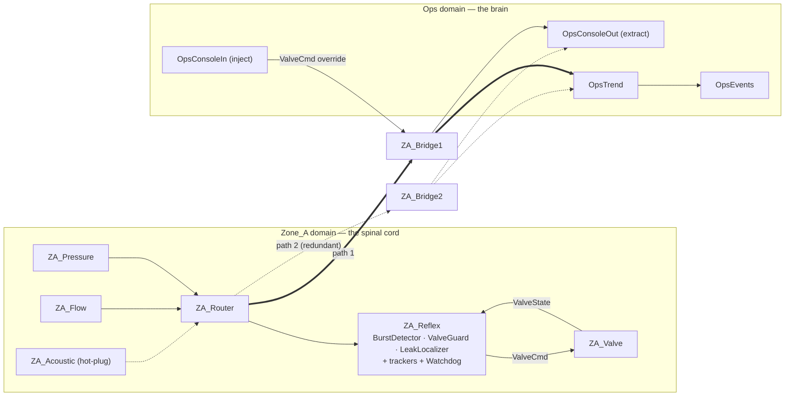
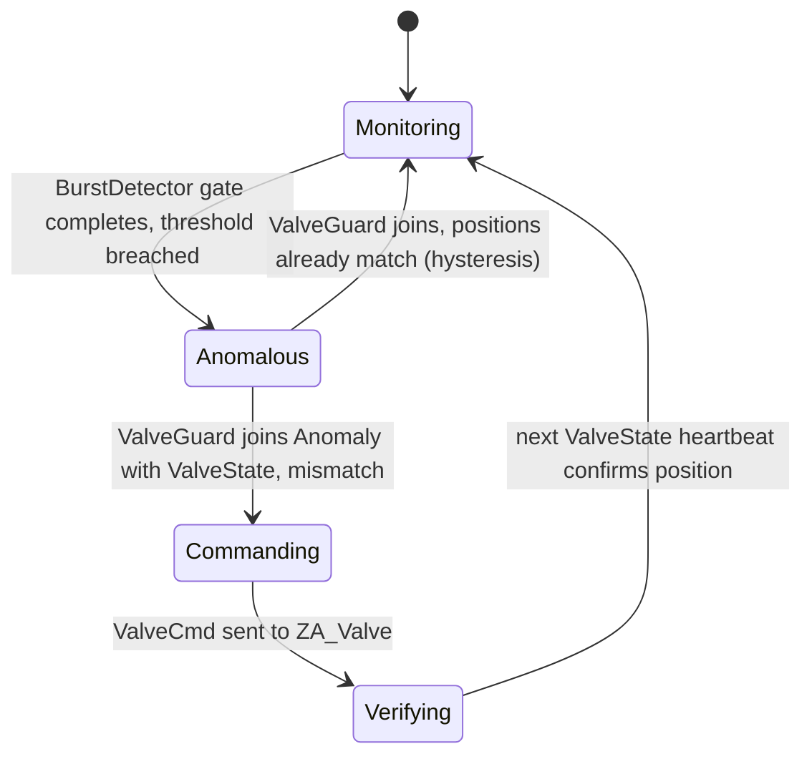
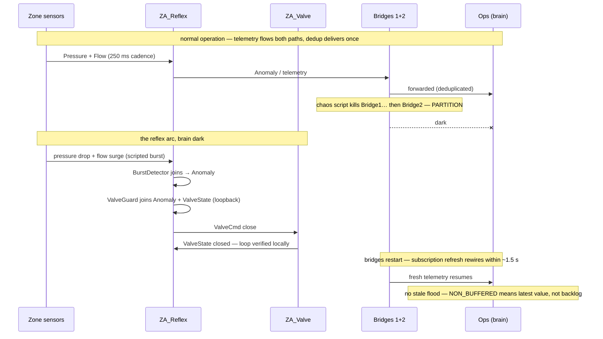

# 7 · Case Study — The Reflex Arc: Local Autonomy Under Partition

The [previous case study](06-case-study-load-balancing.md) read an architecture *out of* the
framework's source. This one runs the other way: it was designed as a technology showcase,
then **built and verified end-to-end**. The implementation lives at
[`demos/ReflexArc/`](../../demos/ReflexArc/) — eight killable JVMs, an automated chaos
runbook, and every claim in §7.1 demonstrated against the live mesh. (It began life as a
standalone sketch under `documents/demos/`, promoted here once it proved out.)

The premise comes straight from the biology. In a nervous system, spinal reflexes work
without the brain: touch a hot surface and the withdrawal happens in the spinal cord — the
signal never needs to reach the cortex, and the reflex keeps working even if the path to the
cortex is severed.

The Reflex Arc builds that property into a simulated piece of physical infrastructure — a
water pump station — and then severs the path to the brain live. A local control loop
(pressure spike → close the valve) keeps protecting the plant while the central analytics
and operator console are dark, and rewires itself automatically when the partition heals.
One demo, thirty seconds, and it is the entire thesis of the framework: **resilience from
the shape of the system, not from a component**.

## 7.1 What it demonstrates — verified

| Claim | How it is shown | Observed (live run) |
|-------|-----------------|---------------------|
| Local autonomy under partition | Kill both bridges, then script a burst | Valve closed by the local reflex with the brain dark: `Anomaly(… severity=3.03)` |
| Safe redundancy | Two bridges ferry the same telemetry; kill either | Framework dedup at work: `Duplicate received … Trace: ZA_Pressure ⇒ ZA_Router ⇒ ZA_Bridge1 ⇒ OpsRouter` |
| Dataflow fusion without code | Burst detection is a receptor join | `REFLEX: closing valve on Anomaly(Zone_A PRESSURE_FLOW_DIVERGENCE severity=2.92)` |
| Absence detection (watchdog) | Kill the flow sensor | `WATCHDOG: sensor ZA_Flow is DOWN (last reading 2388 ms ago)` → restart → `RECOVERED` |
| Latest-value telemetry | Heal the partition | Fresh trends resume immediately — no stale backlog flood |
| Self-wiring mesh / capability gating | Hot-plug the acoustic sensor | `[OPS] Zone_A: leak signature 0.84 — est. offset 101m from station` |
| Zero-config scale-out | Clone the whole zone as `ZB_*` | `[OPS] Anomaly(Zone_B PRESSURE_FLOW_DIVERGENCE severity=3.06)` with zero Ops changes |

## 7.2 The scenario

A water utility with one (later two) pump-station **zones** and a central **operations**
layer. The physics is simulated by the sensor activators themselves — no hardware, no
external simulator process. A "burst" is a scripted pressure drop + flow surge injected by
the chaos script.

Two NeuPaths **domains**:

| Domain | Metaphor | Contains |
|--------|----------|----------|
| `Zone_A` | the spinal cord | sensors, the reflex cell, the valve — the local loop |
| `Ops` | the brain | trend analytics, operator console, audit log |

The domains are joined only by **bridge cells**. Compartmentalization is real: stimuli travel
between domains only if a bridge subscription pulls them across. This is also the security
story — the zone/Ops boundary is exactly where you would put per-synapse crypto keys in an
OT/IT deployment.

## 7.3 The cast (as built)

### Zone_A — the reflex loop

| Cell | Type | Activators | Emits | Purpose |
|------|------|-----------|-------|---------|
| `ZA_Pressure` | LogicCell | `PressureSim` (PulsedActivator, 250 ms) | `Pressure` (DoubleStimulus) | Simulated pressure sensor; each pulse samples the sim state. |
| `ZA_Flow` | LogicCell | `FlowSim` (PulsedActivator, 250 ms) | `Flow` (DoubleStimulus) | Simulated flow sensor. |
| `ZA_Acoustic` | LogicCell | `AcousticSim` (PulsedActivator, 250 ms) | `Acoustic` (DoubleStimulus) | **Started late** — the hot-plug target. |
| `ZA_Reflex` | LogicCell | `BurstDetector`, `ValveGuard`, `LeakLocalizer`, 3 × `GaugeTracker`, `Watchdog` | `Anomaly`, `ValveCmd`, `Leak`, `SensorAlarm` | The spinal neuron — seven activators, one loopback (§7.4). |
| `ZA_Valve` | LogicCell | `ValveActuator` + `ValveHeartbeat` (1 s pulse) | `ValveState` (BooleanStimulus) | Actuator: applies commands to the sim; heartbeats its state. |
| `ZA_Router` | RouterCell | — | — | Zone backbone: the listener every zone cell peers to. |
| `ZA_Events` | EventCell | — | — | Zone audit spool (`out/ZA_events.out`) — the reflex, valve and watchdog narration. |
| `ZA_Bridge1`, `ZA_Bridge2` | BridgeCell | — | *(forwards)* | Two independent paths to Ops (§7.5). |

### Ops — the brain

| Cell | Type | Activators | Purpose |
|------|------|-----------|---------|
| `OpsTrend` | LogicCell | `TrendAnalyzer` | Long-horizon analytics over zone telemetry. (Extension: replace with a `LoadControllerCell` + worker pool, reusing the [§6 architecture](06-case-study-load-balancing.md).) |
| `OpsConsoleIn` | InjectorCell | — | Operator override: inject `ValveCmd` by hand. |
| `OpsConsoleOut` | ExtractorCell | — | Dashboard feed pulled out to ordinary display code (`ConsoleMain`). |
| `OpsEvents` | EventCell | — | Ops audit spool (`out/Ops_events.out`). |
| `OpsRouter` | RouterCell | — | Two listeners — one per bridge path. |

**Stimulus types.** Sensor readings and states use `neupaths.stim` primitives. Two custom
types carry structure: `AnomalyStim` (severity, kind, zone, timestamp) and `ValveCmdStim`
(target position, reason, origin) — also exercising the `TYPE_ID` mechanism across
processes.



The two bridge paths (solid and dashed) carry the same subscribed stimuli. The Nucleus's
duplicate filtering at each consumer makes that redundancy safe — this is the framework's
own dedup doing real work, not demo scaffolding. The live run showed it explicitly, trace
included: `Duplicate received … Trace: ZA_Pressure ⇒ ZA_Router (Zone_A) ⇒ ZA_Bridge1
(Zone_A) ⇒ OpsRouter (Ops)`.

## 7.4 The reflex cell — seven activators, one loopback

`ZA_Reflex` is the interesting cell, and it deliberately reuses the composition techniques
from the [load-balancing case study](06-case-study-load-balancing.md): multiple activators
in one cell, an intra-cell loopback, and dataflow joins as the control logic.

| Activator | Receptors (all NON_BUFFERED) | Emits | Fires when |
|-----------|------------------------------|-------|-----------|
| `BurstDetector` | `Pressure`, `Flow` | `Anomaly` | A fresh pressure *and* a fresh flow reading coexist. Computes divergence; emits only on threshold breach. |
| `ValveGuard` | `Anomaly` (via **loopback**), `ValveState` | `ValveCmd` | An anomaly exists *and* the valve state is known. Emits only if the commanded position differs from the actual — hysteresis as a dataflow join. |
| `LeakLocalizer` | `Pressure`, `Flow`, `Acoustic` | `Leak` | All three sensors are alive. **Cannot complete until `ZA_Acoustic` is hot-plugged** — capability gating. |
| 3 × `GaugeTracker` | one sensor reading each | — | Every reading; stamps its arrival time into a shared cell property. |
| `Watchdog` | `Pulse` (1 s cell pulse) | `SensorAlarm` | Every pulse; compares tracker timestamps against the clock. |



Three properties fall out of the wiring rather than being coded:

- **Hysteresis for free.** `ValveGuard` cannot spam commands: it needs a fresh `ValveState`
  to fire, and the valve heartbeats state at 1 Hz. The *slowest input sets the loop rate* —
  rate limiting by dataflow, no timers in user code.
- **Fail-safe stall.** If a fused sensor dies, the join simply stops completing. The valve
  holds its last commanded position; nothing acts on half-stale data.
- **Capability gating.** `LeakLocalizer` is configured from day one, but its gate cannot
  complete until the acoustic sensor exists. Hot-plugging the sensor *turns on a feature*
  with no reconfiguration anywhere.

### Detecting absence — the watchdog

Fail-safe stall has an honest cost: a dead sensor suspends its joins *silently*, and a
dataflow gate cannot fire on the **absence** of a stimulus. The watchdog
([`Watchdog.java`](../../demos/ReflexArc/Watchdog.java) +
[`GaugeTracker.java`](../../demos/ReflexArc/GaugeTracker.java)) closes that gap with two
cooperating activator roles sharing state through cell properties:

- Each **`GaugeTracker`** fires on every reading from one sensor and stamps
  `setProperty("wd.last.<sensor>", now)`.
- The **`Watchdog`**, a `PulsedActivator` on the cell's 1 s pulse, compares those stamps
  against the clock. More than 2 s stale → a `WARNING` event plus a `SensorAlarm` stimulus;
  readings resuming → a recovery announcement. Sensors that have *never* reported — the
  acoustic sensor before hot-plug — are deliberately not alarmed.

Verified live, kill to page in ~2.4 s:

```
WATCHDOG: sensor ZA_Flow is DOWN (last reading 2388 ms ago)
WATCHDOG: sensor ZA_Flow RECOVERED
```

## 7.5 Wiring plan

### Subscriptions (the interesting rows)

| Consumer (cell · receptor) | Producer spec `(C, T)` | Domain | Note |
|---------------------------|------------------------|--------|------|
| `ZA_Reflex` · `Pressure` | `(ZA_Pressure, Pressure)` | `Zone_A` | |
| `ZA_Reflex` · `Flow` | `(ZA_Flow, Flow)` | `Zone_A` | |
| `ZA_Reflex` · `Acoustic` | `(ZA_Acoustic, Acoustic)` | `Zone_A` | Satisfied only after hot-plug. |
| `ZA_Reflex` · `Anomaly` | loopback `(Anomaly → Anomaly)` | — | `LogicLoopbackSubscriptionSpec`; BurstDetector → ValveGuard inside the cell. |
| `ZA_Reflex` · `ValveState` | `(ZA_Valve, ValveState)` | `Zone_A` | |
| `ZA_Valve` · `Cmd` | `(ZA_Reflex, ValveCmd)` **and** `(OpsConsoleIn, ValveCmd)` | `Zone_A` | Two subscriptions, one receptor — reflex and operator override aggregate. |
| `OpsTrend` · `Pressure` etc. | `(.*_Pressure, Pressure)` … | `Ops` | **Regex fleet aggregation**: one subscription covers Zone A today and Zone B tomorrow. |
| `OpsConsoleOut` | `(.*_Reflex\|OpsTrend, Anomaly\|Leak\|SensorAlarm\|Trend)` | `Ops` | One extractor subscription; the dashboard sees every zone. |
| `ZA_Bridge1/2` (bridge subs) | `(ZA_.*, telemetry regex)` from `Zone_A`; `(OpsConsoleIn, ValveCmd)` from `Ops` | — | Pull telemetry out of the zone and overrides into it; the bridges then forward per subscriptions learned from each side. |

The zone prefix and domain in the Java constructors come from `-Dreflex.zone` (default
`A`), which is what lets `chaos.sh zoneb` clone an entire zone from sed-edited XML without
touching a line of Java.

### Synapses (single-host build, Unix sockets)

| Cell | Synapse name(s) |
|------|----------------|
| `ZA_Router` | `Local#Stream#Listener#Zone_A#/tmp/reflex/za.sock` |
| zone cells | `Local#Stream#Peer#Zone_A#/tmp/reflex/za.sock` |
| `OpsRouter` | `Local#Stream#Listener#Ops#/tmp/reflex/ops1.sock` **and** `…ops2.sock` |
| `ZA_Bridge1` | peer `za.sock` (Zone_A) **+** peer `ops1.sock` (Ops) |
| `ZA_Bridge2` | peer `za.sock` (Zone_A) **+** peer `ops2.sock` (Ops) |

Two-host variant: swap `Local#Stream` for `Network#Stream` with ports and run the bridges
over genuinely different routes. Each cell (or small group) is its own `CellCluster` XML +
JVM — launched by `neupaths.util.CellClusterExec` — so the chaos script kills real
processes.

## 7.6 The partition — the money shot



As run: with both bridges dead, the scripted burst produced
`REFLEX: closing valve on Anomaly(Zone_A PRESSURE_FLOW_DIVERGENCE severity=3.03)` and
`valve.pos: CLOSED` while the Ops event log stayed flat; after `chaos.sh heal`, trends
resumed at Ops within seconds showing post-closure physics
(`TREND: avg pressure 6.43 bar …`).

The reconnect behavior deserves narration: a broker-based system that was down for two
minutes replays two minutes of stale queue at the consumer. The mesh comes back with
*current* state only — for telemetry, that is the correct semantics, and it is free.

## 7.7 The runbook, as run

`demos/ReflexArc/chaos.sh` automates the sequence; the README there maps each command to
its claim. All steps below were executed against the live mesh.

| # | Action | Observed | Claim |
|---|--------|----------|-------|
| 1 | `./run.sh` — 8 JVMs | All processes RUNNING; trends flowing to Ops | baseline |
| 2 | `chaos.sh burst` | `VALVE CLOSED by ZA_Reflex: PRESSURE_FLOW_DIVERGENCE severity=2.92` | the dataflow reflex |
| 3 | `chaos.sh kill-bridge1` | Telemetry uninterrupted; dedup traces name the surviving path | safe redundancy |
| 4 | `chaos.sh kill-flow` | `WATCHDOG: sensor ZA_Flow is DOWN`; detection suspends; valve holds | watchdog + fail-safe stall |
| 5 | `chaos.sh start ZA_Flow` | `WATCHDOG: … RECOVERED`; rewired with no config | self-wiring mesh |
| 6 | `chaos.sh partition` + `burst` | **Valve closed with the brain dark** (severity 3.03) | the reflex arc |
| 7 | `chaos.sh heal` | Fresh trends at Ops; no backlog flood | latest-value semantics |
| 8 | `chaos.sh hotplug` | `[OPS] Zone_A: leak signature 0.84 — est. offset 101m` | capability gating |
| 9 | `chaos.sh zoneb` | `[OPS] Anomaly(Zone_B …)`; ZB reflex closed ZB valve independently | regex scale-out |
| 10 | broker twin under steps 3–7 | *(future work)* hub dies → everything dies; reconnect → stale flood | the comparison |

Step 10 is what turns the demo into a showcase: the same scenario, a minimal hub-and-spoke
twin, the same chaos script, and a split-screen of both dashboards. Claims become graphs.

## 7.8 Honest notes

- **No replay after heal.** Telemetry lost during a partition is gone. For sensor data that
  is a feature; the demo script should say so explicitly rather than let the audience
  discover it as a surprise. Do not pitch this demo shape for data with audit/billing
  semantics.
- **Keep the twin fair.** The broker twin should be a *reasonable* minimal implementation
  (reconnect logic, QoS-style acks), not a strawman. The demo's claims survive a fair twin;
  an unfair one undermines the whole showcase.
- **Timing to tune.** Sensor cadence (250 ms), valve heartbeat (1 s), watchdog staleness
  (2 s) and `subscriptionRefreshInterval` (default 1.5 s) set the demo's visible rhythms —
  rewire time after heal is roughly one refresh interval, so leave the default alone for a
  snappy stage recovery.
- **Dedup logging is chatty by design here.** With both bridges up, every reading arrives
  twice at Ops and the second copy is logged as a duplicate warning. That is the redundancy
  *visibly working*; for a quieter demo, disable logging on the Ops router or narrow the
  bridge telemetry regex.

## 7.9 Implementation layout

```
demos/ReflexArc/              flat, default package — matching the examples/ house style
  README.md                   build, run, and the runbook table
  PlantState.java             zone-aware simulated physics, shared across JVMs via
                              tiny files under /tmp/reflex/zone<ID>/
  PressureSim/FlowSim/AcousticSim.java     250 ms PulsedActivator sensors
  BurstDetector/ValveGuard/LeakLocalizer.java   the reflex cell's pipeline
  GaugeTracker + {Pressure,Flow,Acoustic}Tracker + Watchdog.java   sensor liveness (§7.4)
  ValveActuator/ValveHeartbeat.java        the actuator cell
  TrendAnalyzer.java          the brain (regex fleet aggregation)
  AnomalyStim/ValveCmdStim.java            custom stimulus types
  ConsoleMain.java            operator console (inject overrides / extract alarms)
  cfg/                        one cell XML per cell + one Cl_*.xml cluster per
                              killable JVM; Zone B configs are sed-generated by chaos.sh
  run.sh / chaos.sh           start everything / the runbook, automated
```

## 7.10 Where to look in the framework

| Concern | Reference |
|---------|-----------|
| Pulse generator + `PulsedActivator` | [`Cell.java`](../../source/java/neupaths/api/Cell.java) (`setPulseInterval`), [`PulsedActivator.java`](../../source/java/neupaths/api/PulsedActivator.java) |
| Loopback subscriptions | [`LogicLoopbackSubscriptionSpec.java`](../../source/java/neupaths/api/LogicLoopbackSubscriptionSpec.java), used heavily in [§6](06-case-study-load-balancing.md) |
| Bridge semantics | [`BridgeCell.java`](../../source/java/neupaths/api/BridgeCell.java) — bridge subs pull *to* the bridge; forwarding follows learned subscriptions |
| Duplicate filtering (redundant paths) | [`Nuc_Nucleus.java`](../../source/java/neupaths/api/Nuc_Nucleus.java) `stimuliHistory`, design docs [§3.1](03-subsystems.md) |
| Latest-value receptors | `ReceptorMode.NON_BUFFERED`, design docs [§2.5](02-domain-model.md) |
| Multi-cluster daemon deployment (alt. to run.sh) | [`CellClusterDaemon`](../../source/java/neupaths/util/CellClusterDaemon.java) + `IssueCommandToDaemon` |
| The demo itself | [`demos/ReflexArc/`](../../demos/ReflexArc/) — README, sources, `cfg/`, `run.sh`, `chaos.sh` |

Back to the [documentation index](README.md).
